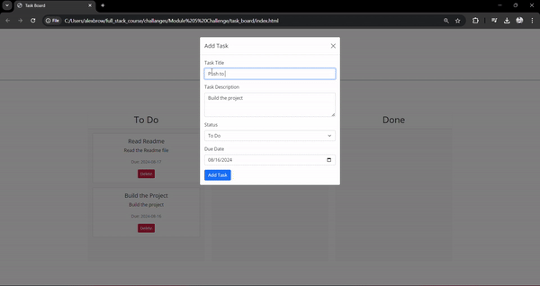

# task_board

## Description
This project is a homemade kanban board used for tracking progress on large and complex projects. 

## Table of Contents
- [Installation](#installation)
- [Usage](#usage)
- [Licensing](#licensing)
- [Contributors](#contributors)
- [Testing](#testing)
- [Questions](#questions)

## Installation
Dowwnload the Repo files. 

Navigate to the HTML page in a web browser. 

Or visit the static Site. https://djdevjams.github.io/task_board/

## Usage
This project will be used to manage future projects by outlinig  Task  ToDo  InProgress and Completed.

## Licensing

## Contributors
None

## Testing
The task_board allows tasks to be added and updated. 

## Questions
Any lingering questions? Please contact me:
- GitHub: [DJDevJams](https://github.com/DJDevJams)
- Email: alex.art.brown@gmail.com
